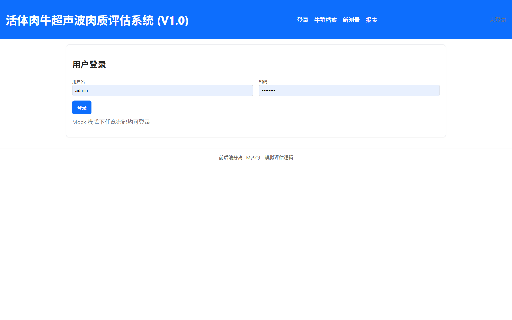
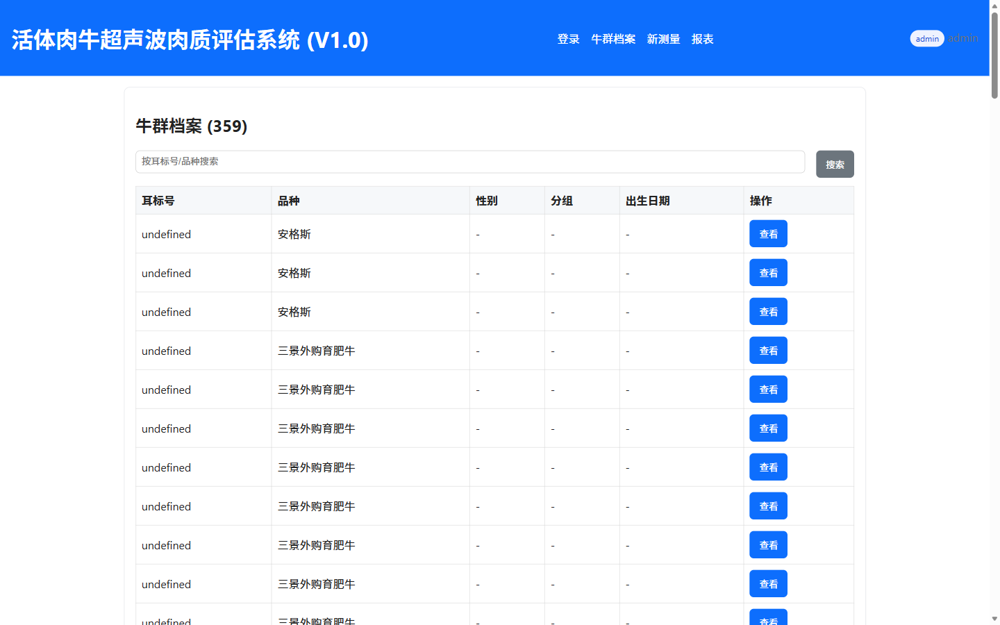
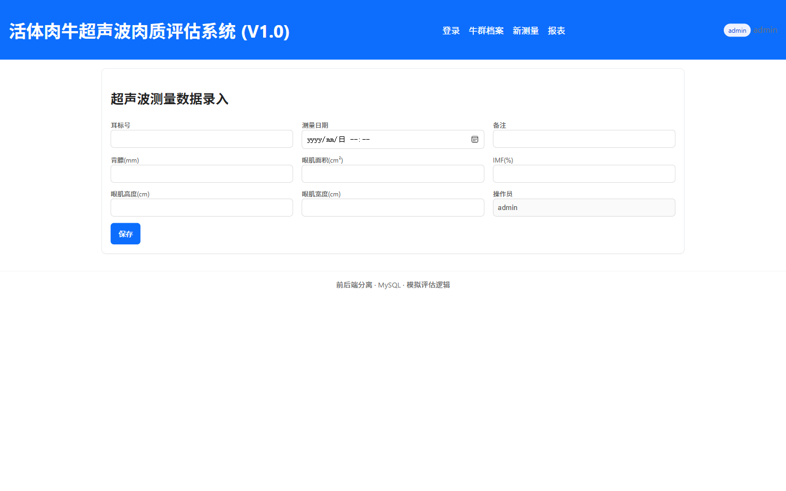
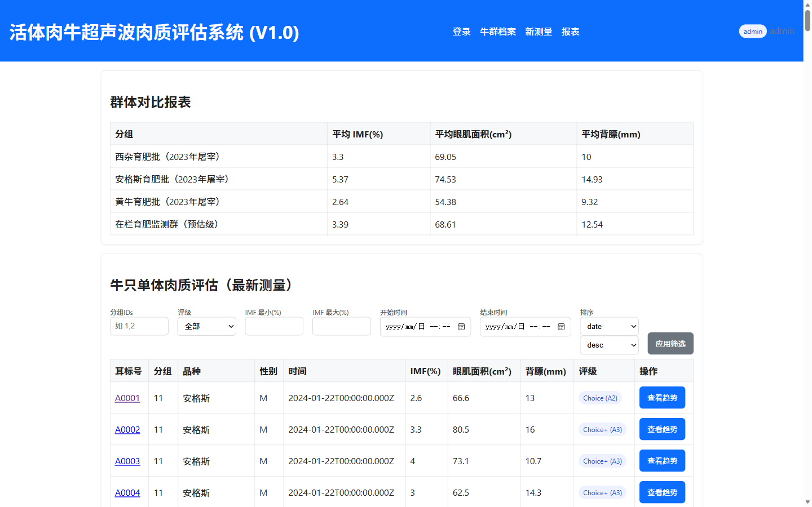

# 活体肉牛超声波肉质评估系统 用户操作手册

---

**版本：** V1.0  
**发布日期：** 2026年4月  
**适用系统：** 活体肉牛超声波肉质评估系统（IMF Assessment System）  
**访问地址：** http://服务器IP:8081  
**技术支持：** 绿姆山牛场AI系统运维团队

---

## 目录

1. [系统简介](#1-系统简介)
2. [登录与退出](#2-登录与退出)
3. [牛群档案管理](#3-牛群档案管理)
4. [超声波测量数据录入](#4-超声波测量数据录入)
5. [报表与数据分析](#5-报表与数据分析)
6. [肉质评级参考标准](#6-肉质评级参考标准)
7. [常见问题解答](#7-常见问题解答)
8. [联系支持](#8-联系支持)

---

## 1. 系统简介

活体肉牛超声波肉质评估系统（IMF系统）专用于对在栏肉牛进行非侵入式的肉质测量与管理。系统利用超声波成像设备采集背膘厚度、眼肌面积和肌内脂肪含量（IMF%）等关键数据，结合数字化档案和智能评级算法，帮助牧场管理人员在出栏前掌握每头牛的肉质状况。

**系统主要功能：**

- 牛只档案录入与检索
- 超声波测量数据录入与存储
- IMF肉质评级（A2至A5及以上）
- 群体对比报表与趋势分析
- 数据筛选与导出

**技术架构：**

- 前端：原生 JavaScript SPA，Hash 路由
- 后端：Node.js / Express + MySQL（统一后端，端口 3000）
- 访问端口：8081

---

## 2. 登录与退出

### 2.1 登录步骤

1. 打开浏览器，在地址栏输入 `http://服务器IP:8081`，按回车键
2. 系统显示登录页面

3. 在"用户名"输入框中输入 `admin`（或分配给您的账号名称）
4. 在"密码"输入框中输入对应密码（默认管理员密码：`admin123`）
5. 点击"登录"按钮
6. 登录成功后，页面顶部右侧将显示当前用户角色和用户名，并自动跳转至牛群档案页面

> **注意：** 系统支持多账号管理。普通操作员账号（operator）只能录入和查看数据，不能管理系统用户。管理员账号（admin）拥有全部权限。

### 2.2 退出登录

点击页面顶部导航栏中的"登录"链接，重新进入登录页即可退出当前会话。建议在共用电脑上操作完毕后及时退出。

---

## 3. 牛群档案管理

牛群档案是系统的基础数据模块。每头参与超声波评估的牛只都需要在系统中建立档案，包含耳标号、品种、性别、出生日期等信息。

### 3.1 查看牛群档案

登录后点击顶部导航栏的"牛群档案"，进入档案列表页面。

页面显示以下信息：

| 字段 | 说明 |
|------|------|
| 耳标号 | 每头牛的唯一标识（如 A0001） |
| 品种 | 牛的品种（如安格斯、西杂、黄牛） |
| 性别 | male（公）/ female（母） |
| 分组 | 栏位分组编号 |
| 出生日期 | 牛只出生年月日 |
| 操作 | 点击"查看"进入该牛详情页 |

### 3.2 搜索牛只

在列表页上方的搜索框中输入耳标号或品种关键词，点击"搜索"按钮，可快速定位目标牛只。

### 3.3 新增牛只

在牛群档案页面下方有"新增牛只"表单，填写以下字段后点击"新增"按钮完成创建：

| 字段 | 是否必填 | 说明 |
|------|----------|------|
| 耳标号 | 必填 | 全场唯一，建议与耳标实物编号一致 |
| 品种 | 建议填写 | 如"安格斯""西门塔尔"等 |
| 性别 | 建议填写 | male 或 female |
| 分组ID | 选填 | 填写对应栏位的数字编号 |
| 出生日期 | 选填 | 格式 YYYY-MM-DD |
| 父系耳标 | 选填 | 留作系谱追溯 |
| 母系耳标 | 选填 | 留作系谱追溯 |

> **提示：** 耳标号一旦创建后无法修改，请仔细核对。如需变更，请联系管理员处理。

### 3.4 查看个体详情

在档案列表中点击某头牛的"查看"按钮，进入个体详情页。详情页包括：

- **基本信息**：耳标号、品种、性别、出生日期等
- **最新测量**：最近一次超声波测量的 IMF%、眼肌面积、背膘厚度和评级
- **测量历史表**：历次测量数据的完整记录，按时间倒序排列
- **IMF趋势图**：折线图直观展示该头牛历次测量的 IMF% 变化趋势

---

## 4. 超声波测量数据录入

每次对牛只进行超声波扫描后，测量员应及时将数据录入系统。

### 4.1 进入新测量页面

点击顶部导航栏的"新测量"，进入数据录入表单。

### 4.2 填写测量数据

表单包含以下字段：

| 字段 | 说明 |
|------|------|
| 牛只耳标号 | 输入或从下拉列表选择，确保选中正确的牛只 |
| 测量日期 | 默认为今天，可手动修改 |
| 测量设备ID | 填写超声波仪器的设备编号（如 `IMG-001`） |
| 图像文件名 | 超声波图像的存档文件名（选填） |
| IMF (%) | 超声波解析得出的肌内脂肪百分比，保留一位小数 |
| 眼肌面积 (cm²) | 第12至13肋间眼肌横截面积 |
| 背膘厚度 (mm) | 背部皮下脂肪厚度 |
| 备注 | 选填，可记录异常情况或测量条件 |

> **重要：** IMF(%)、眼肌面积、背膘厚度是核心指标，必须准确录入。系统将根据 IMF% 自动判定评级。

### 4.3 保存测量数据

填写完成后点击"保存测量记录"按钮。

保存成功后，页面会显示成功提示，同时系统自动计算并显示本次的 IMF 评级。数据会立即反映在该牛只的个体详情页和报表中。

---

## 5. 报表与数据分析

报表模块提供两个维度的数据分析：群体对比和个体筛选评估。

### 5.1 进入报表页面

点击顶部导航栏的"报表"，进入报表页面。

### 5.2 群体对比报表

页面上方的"群体对比报表"表格按分组汇总显示：

| 列名 | 说明 |
|------|------|
| 分组 | 栏位分组名称或批次 |
| 平均 IMF(%) | 该分组所有牛只的 IMF% 均值 |
| 平均眼肌面积(cm²) | 该分组眼肌面积均值 |
| 平均背膘(mm) | 该分组背膘厚度均值 |

管理员可通过对比各分组数据，判断哪批牛只已达到出栏标准。

### 5.3 个体筛选评估

页面下方的"牛只单体肉质评估"区域提供多维度筛选功能：

| 筛选条件 | 用法 |
|----------|------|
| 分组IDs | 输入分组编号（多个用逗号分隔，如 `1,2`） |
| 评级 | 下拉选择：全部 / A2 / A3 / A4 / A5 / Standard |
| IMF最小(%) | 设置 IMF% 下限 |
| IMF最大(%) | 设置 IMF% 上限 |
| 开始时间 | 测量日期范围起始 |
| 结束时间 | 测量日期范围结束 |
| 排序 | 按日期或 IMF 值排序，可选升序/降序 |

设置筛选条件后点击"应用筛选"按钮，结果表格显示符合条件的所有牛只的最新测量数据。

> **实用场景：** 出栏决策前，将"评级"设为"A3"，即可快速筛出所有达到 Choice+ 及以上标准的牛只，结合眼肌面积和背膘数据制定出栏计划。

---

## 6. 肉质评级参考标准

系统根据 IMF% 自动判定评级，对应以下标准：

| 评级 | IMF% 范围 | 描述 |
|------|-----------|------|
| A5（极优） | 大于等于 6% | 最高等级，大理石纹丰富 |
| A4（优） | 4.5% 至 6% | 高端市场主要等级 |
| A3 / Choice+（优质） | 3% 至 4.5% | 优质级别，主流消费市场 |
| A2 / Choice（良好） | 2% 至 3% | 良好级别 |
| Standard（标准） | 小于 2% | 标准级，建议延长育肥期 |

> **说明：** 以上评级标准参考澳大利亚牛肉分级体系（AUS-MEAT）。养殖场可根据客户要求调整内部标准。

---

## 7. 常见问题解答

**Q1：登录时提示"用户名或密码错误"怎么办？**  
A：请检查大小写是否正确。如忘记密码，请联系管理员重置。默认管理员账号：admin / admin123。

**Q2：录入数据后保存失败，提示网络错误？**  
A：检查网络连接是否正常，确认后端服务（端口 3000）是否运行。可尝试刷新页面后重新录入。

**Q3：为什么新增牛只时提示"耳标号已存在"？**  
A：该耳标号已被系统录入过。请在搜索框中查询该耳标号确认是否重复录入。

**Q4：如何修改已录入的测量数据？**  
A：当前版本不支持直接编辑已保存的测量记录。如需修正，请联系管理员处理。

**Q5：报表页面显示的群体数据是否包含所有历史测量？**  
A：群体对比表显示的是各分组内所有牛只的最新一次测量均值，不包含历史测量。

**Q6：如何查看某头牛的完整测量历史？**  
A：在"牛群档案"页面找到该牛，点击"查看"进入档案详情页，可查看全部测量历史和 IMF 趋势图。

---

## 8. 联系支持

如在使用过程中遇到系统问题或功能疑问，请联系：

- **系统管理员：** 联系场内信息管理员
- **系统访问地址：** http://服务器IP:8081
- **默认管理员账号：** admin / admin123

---

*本操作手册 V1.0，绿姆山牛场AI系统团队编写*  
*如需更新本手册，请联系系统运维人员*
