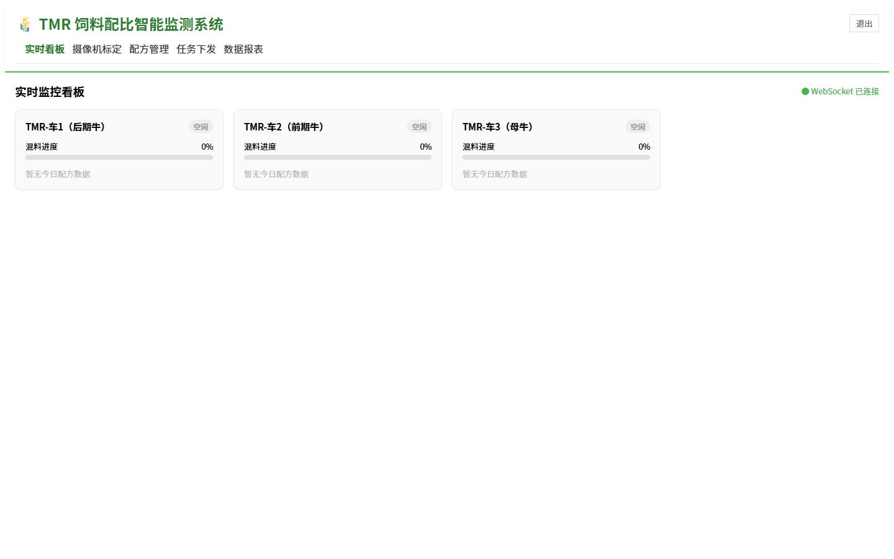
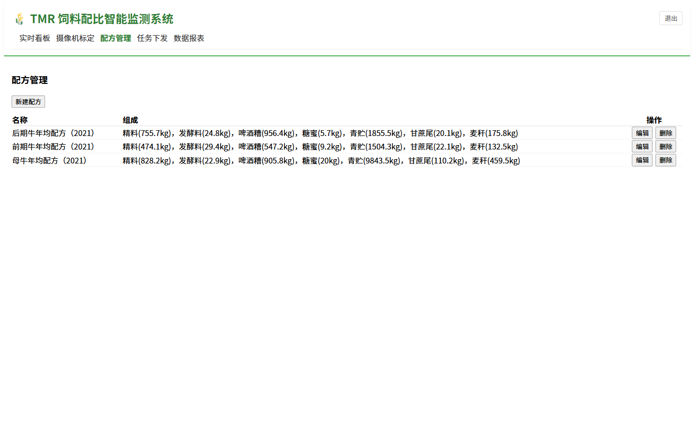
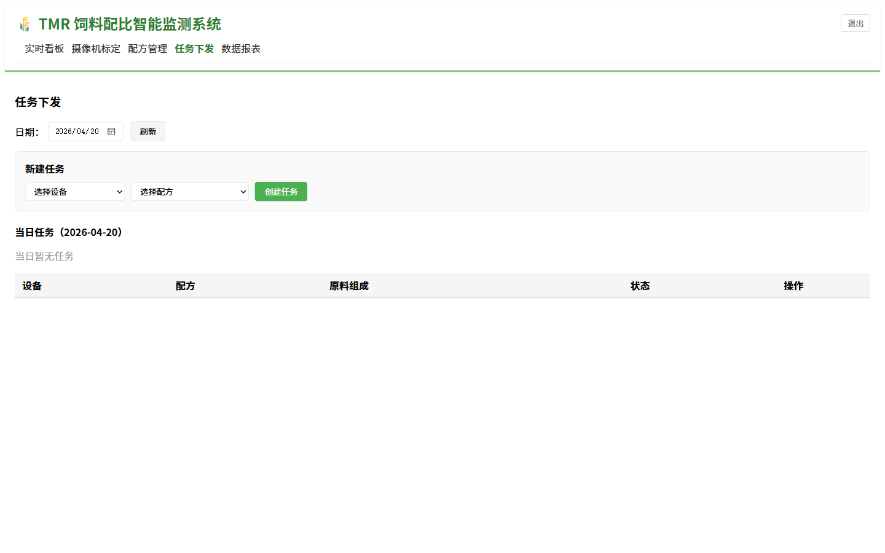
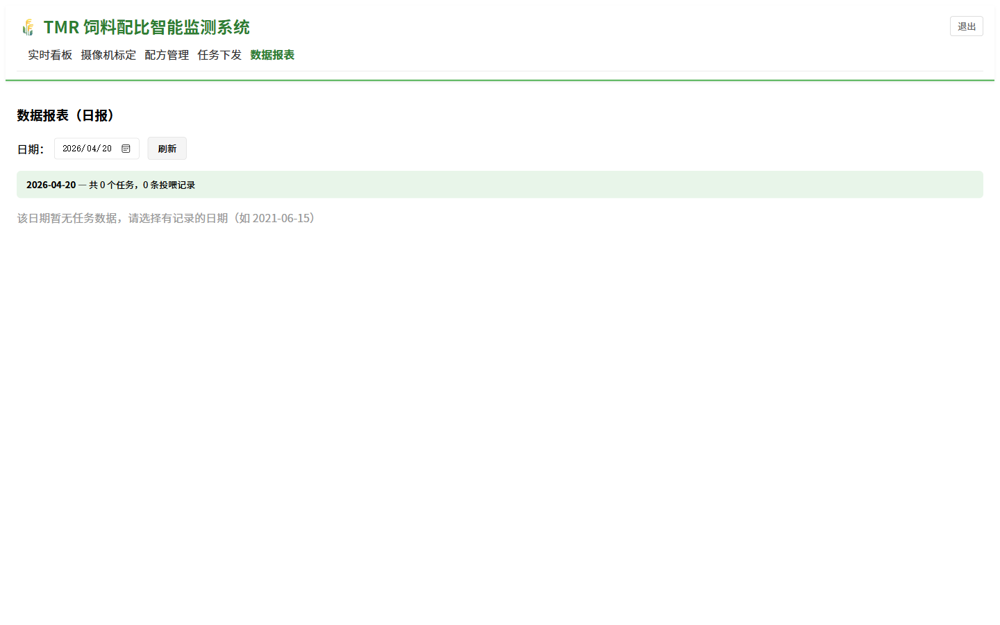

# TMR 饲料配比智能监测系统 用户操作手册

---

**版本：** V1.0  
**发布日期：** 2026年4月  
**适用系统：** TMR 饲料配比智能监测系统（TMR Monitoring System）  
**访问地址：** http://服务器IP:8083  
**技术支持：** 绿姆山牛场AI系统运维团队

---

## 目录

1. [系统简介](#1-系统简介)
2. [登录与退出](#2-登录与退出)
3. [实时监控看板](#3-实时监控看板)
4. [配方管理](#4-配方管理)
5. [任务下发](#5-任务下发)
6. [数据报表](#6-数据报表)
7. [误差控制标准](#7-误差控制标准)
8. [常见问题解答](#8-常见问题解答)
9. [联系支持](#9-联系支持)

---

## 1. 系统简介

TMR 饲料配比智能监测系统（TMR系统）用于管理全混合日粮（Total Mixed Ration）的配方制定、饲喂任务下发和实时混料进度监控。系统通过 WebSocket 实时推送每台 TMR 车的混料状态，确保配比精准、饲喂到位，并生成每日饲喂报表供管理人员审查。

**系统主要功能：**

- 饲料配方创建与版本管理
- 按日期和牛群批次下发饲喂任务
- TMR 车混料进度实时监控
- 每日计划与实际用量对比报表
- WebSocket 实时数据推送

**技术架构：**

- 前端：React 18 + React Router v6 + Socket.io-client
- 后端：Node.js / Express + Socket.io + MySQL（统一后端，端口 3000）
- 访问端口：8083

---

## 2. 登录与退出

### 2.1 登录步骤

1. 打开浏览器，在地址栏输入 `http://服务器IP:8083`，按回车键
2. 系统显示登录页面

3. 在"用户名"输入框中输入 `admin`（默认管理员账号）
4. 在"密码"输入框中输入 `admin123`（默认密码）
5. 点击"登录"按钮
6. 登录成功后自动进入实时看板页面

### 2.2 导航说明

登录后，页面顶部显示主导航栏：

| 导航项 | 功能 |
|--------|------|
| 实时看板 | TMR 车实时混料状态监控 |
| 摄像机标定 | 摄像头视角配置（运维专用） |
| 配方管理 | 饲料配方的创建和维护 |
| 任务下发 | 当日饲喂任务的分配和追踪 |
| 数据报表 | 历史饲喂数据统计报表 |

### 2.3 退出登录

点击页面右上角"退出"按钮，系统清除登录状态并返回登录页面。

---

## 3. 实时监控看板

实时监控看板是系统的核心功能模块，通过 WebSocket 技术实时显示每台 TMR 车的混料进度。

### 3.1 查看实时状态

登录后点击顶部导航栏"实时看板"。

页面右上角显示"WebSocket 已连接"（绿色圆点），表示数据正在实时更新。如显示"未连接"，请刷新页面或联系运维人员。

### 3.2 设备状态卡片

每台 TMR 车对应一个状态卡片，卡片显示：

| 信息项 | 说明 |
|--------|------|
| 设备名称 | 如 TMR-车1（后期牛）、TMR-车2（前期牛） |
| 状态标签 | 空闲 / 混料中 / 完成 |
| 混料进度 | 进度条显示当前批次完成百分比 |
| 今日配方 | 当前执行的配方名称 |
| 原料列表 | 各原料的计划用量和已投入量 |

**状态说明：**

- **空闲（灰色）**：该车今日无任务，或任务尚未开始
- **混料中（蓝色）**：正在按配方投料混合
- **完成（绿色）**：当日任务已完成

### 3.3 数据自动刷新

看板数据通过 WebSocket 长连接实时更新，无需手动刷新页面。当某台 TMR 车的混料进度发生变化时，对应卡片会自动更新。

> **提示：** 若长时间未见数据更新，可刷新页面重新建立 WebSocket 连接。

---

## 4. 配方管理

配方管理模块用于维护各牛群批次的 TMR 饲料配方，包括原料种类和用量。

### 4.1 查看配方列表

点击顶部导航栏"配方管理"。

配方列表显示所有已创建的配方，每条记录包含：

- 配方名称（如"后期育肥牛配方""泌乳牛配方"）
- 适用牛群批次
- 创建/修改日期
- 操作按钮（编辑、删除）

### 4.2 新建配方

点击列表右上角"新建配方"按钮，进入配方编辑界面。

**新建配方步骤：**

1. 输入配方名称（建议包含牛群批次信息，如"2024后期育肥-安格斯"）
2. 在原料列表中添加原料：
   - 点击"添加原料"
   - 输入原料名称（如"青贮玉米""干草""精料"）
   - 输入该批次的计划用量（kg）
3. 重复步骤2，直到添加完所有原料
4. 点击"保存配方"按钮

**配方示例（后期育肥牛，每车次）：**

| 原料 | 计划用量 |
|------|---------|
| 青贮玉米 | 800 kg |
| 干草 | 200 kg |
| 酒糟 | 150 kg |
| 精料 | 100 kg |
| 矿物质添加剂 | 5 kg |

### 4.3 编辑和删除配方

- **编辑**：点击配方列表中的"编辑"按钮，修改配方名称或原料用量后保存
- **删除**：点击"删除"按钮，系统弹出确认对话框，确认后永久删除该配方

> **注意：** 已分配给当日任务的配方不能删除，需先取消对应任务后才可删除。

---

## 5. 任务下发

任务下发模块用于为每台 TMR 车分配当日的饲喂任务，关联具体配方并追踪执行状态。

### 5.1 查看任务列表

点击顶部导航栏"任务下发"。

页面分为两个区域：

- **上方**：日期选择器和新建任务表单
- **下方**：选定日期的任务列表

### 5.2 新建任务

在页面上方的"新建任务"表单中：

1. 选择任务日期（默认为今天）
2. 选择目标 TMR 车（从下拉列表选择）
3. 选择使用的配方（从已创建的配方列表中选择）
4. 输入目标批次数量（车次）
5. 点击"下发任务"按钮

任务创建后，对应 TMR 车在实时看板上的状态将更新为"待执行"。

### 5.3 任务状态追踪

下方任务列表显示当日所有任务的执行状态：

每条任务记录包含：

| 字段 | 说明 |
|------|------|
| 设备 | 执行此任务的 TMR 车 |
| 配方 | 使用的配方名称 |
| 批次 | 计划车次数量 |
| 状态 | 待执行 / 混料中 / 已完成 |
| 操作 | 状态更新按钮 |

### 5.4 更新任务状态

操作人员可以手动更新任务状态，反映实际执行进度：

- 点击"开始混料"：将状态从"待执行"更新为"混料中"
- 点击"标记完成"：将状态从"混料中"更新为"已完成"

> **注意：** 状态一旦设为"已完成"，不可回退。如操作有误，请联系管理员。

---

## 6. 数据报表

数据报表模块提供历史饲喂数据的汇总统计，支持计划与实际用量的对比分析。

### 6.1 查看报表

点击顶部导航栏"数据报表"。

### 6.2 汇总统计

页面顶部显示选定日期范围内的汇总数据：

- 总任务数
- 已完成任务数
- 总计划用料量（kg）
- 总实际用料量（kg）
- 整体误差率（%）

### 6.3 设备详细报告

每台设备对应一个详细报告卡片，显示该设备在选定时间段内的表现：

| 指标 | 说明 |
|------|------|
| 完成批次 | 已完成的任务车次数 |
| 整体混料进度 | 进度条形式展示 |
| 原料对比表 | 每种原料的计划用量 vs 实际投入量及误差率 |

### 6.4 查询不同日期

使用页面顶部的日期选择器，可以查询历史任意日期的报表数据。点击"查询"按钮刷新结果。

---

## 7. 误差控制标准

TMR 饲料配比的精准度直接影响牛只健康和育肥效果。以下为参考误差控制标准：

| 原料类型 | 允许误差范围 | 说明 |
|----------|------------|------|
| 青贮玉米 | 小于等于 5% | 青贮密度变化较大，允许略宽 |
| 干草类 | 小于等于 3% | 称量相对准确 |
| 精料（浓缩料） | 小于等于 2% | 高营养密度，需严格控制 |
| 矿物质/添加剂 | 小于等于 1% | 微量添加，最严格控制 |

报表中误差率超过上述标准的原料会以红色高亮显示，提示操作人员需要关注并改善投料精度。

---

## 8. 常见问题解答

**Q1：看板页面显示"WebSocket 未连接"怎么办？**  
A：刷新浏览器页面，系统会自动重新建立 WebSocket 连接。如刷新后仍无法连接，请联系运维人员检查后端服务（端口 3000）是否正常运行。

**Q2：新建配方后，任务下发时找不到该配方？**  
A：请刷新"任务下发"页面后再尝试。若仍无法找到，确认配方已保存成功（在配方管理列表中可见）。

**Q3：任务状态不能更新，按钮点击后没有反应？**  
A：可能是网络连接中断或后端服务异常。刷新页面后重试，或联系运维人员检查服务状态。

**Q4：报表中某台设备的数据不显示？**  
A：该设备可能当天没有任务记录，或任务状态尚未更新为"已完成"。确认已正确下发并完成当日任务。

**Q5：如何修改已下发的任务？**  
A：当前版本不支持修改已创建的任务。若需要调整，可删除原任务后重新下发。仅管理员权限可删除任务。

**Q6：看板上某台 TMR 车一直显示"空闲"但实际已在混料？**  
A：请在任务下发页面确认已为该设备创建当日任务并点击"开始混料"更新状态。看板数据反映系统中的任务状态，需操作人员手动更新。

---

## 9. 联系支持

如在使用过程中遇到系统问题或功能疑问，请联系：

- **系统管理员：** 联系场内信息管理员
- **系统访问地址：** http://服务器IP:8083
- **默认管理员账号：** admin / admin123

---

*本操作手册 V1.0，绿姆山牛场AI系统团队编写*  
*如需更新本手册，请联系系统运维人员*
