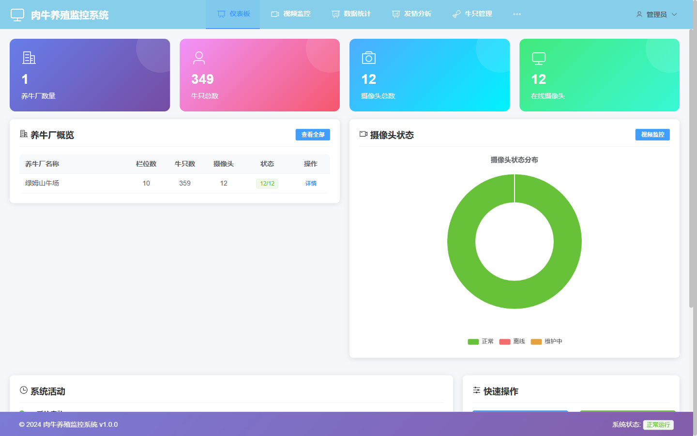
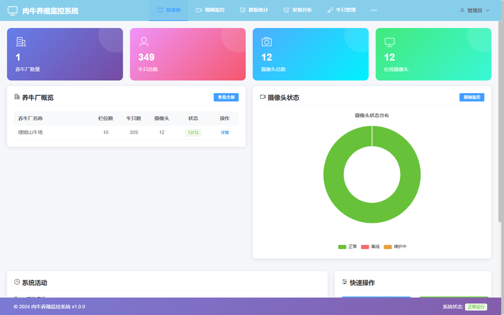
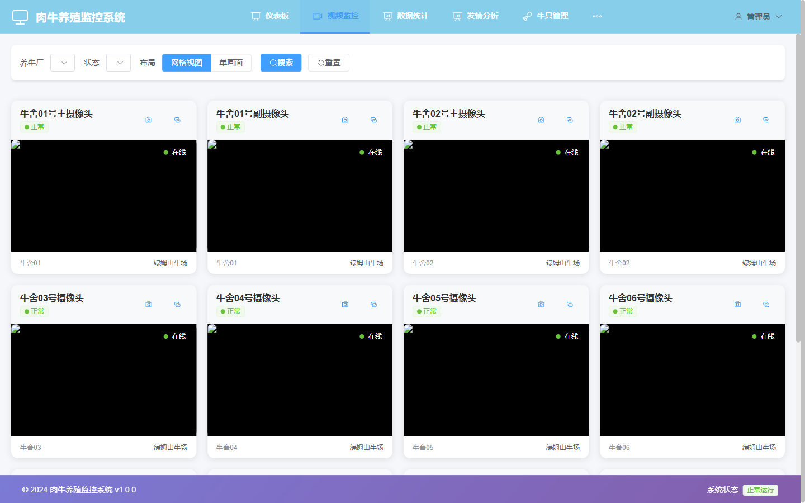
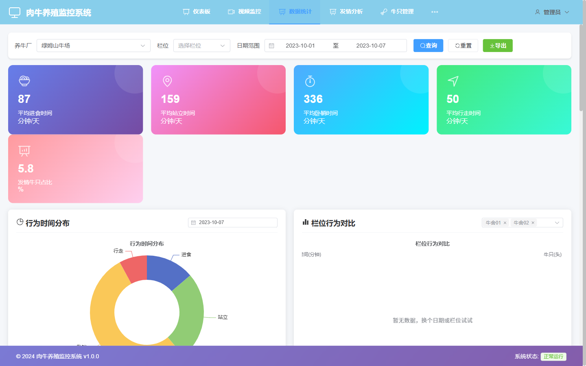
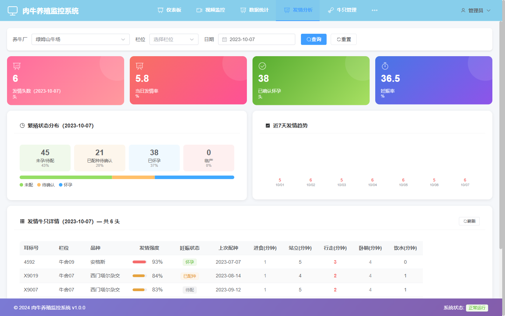
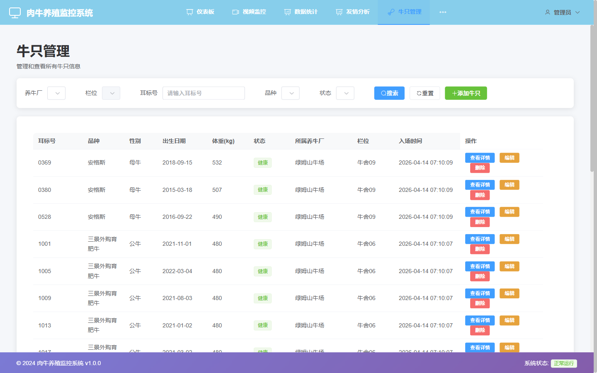
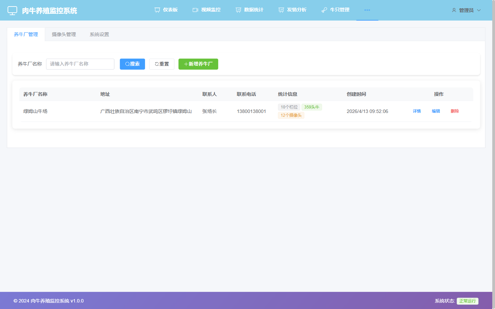

# 肉牛养殖行为监控系统 用户操作手册

---

**版本：** V1.0  
**发布日期：** 2026年4月  
**适用系统：** 肉牛养殖行为监控系统（Cattle Behavior Monitoring System）  
**访问地址：** http://服务器IP:8082  
**技术支持：** 绿姆山牛场AI系统运维团队

---

## 目录

1. [系统简介](#1-系统简介)
2. [登录与退出](#2-登录与退出)
3. [仪表板](#3-仪表板)
4. [视频监控](#4-视频监控)
5. [数据统计](#5-数据统计)
6. [发情分析](#6-发情分析)
7. [牛只管理](#7-牛只管理)
8. [系统管理](#8-系统管理)
9. [常见问题解答](#9-常见问题解答)
10. [联系支持](#10-联系支持)

---

## 1. 系统简介

肉牛养殖行为监控系统通过部署在牛舍内的摄像头，结合 AI 图像识别技术，对每头牛的日常行为（采食、躺卧、站立、运动）进行全天候自动记录和统计。系统可帮助饲养员及早发现异常行为，识别发情迹象，从而优化饲养管理决策。

**系统主要功能：**

- 多路摄像头实时监控与录像
- 牛只行为自动识别与统计
- 发情行为自动预警与周期分析
- 栏位对比分析与异常报警
- 牛只档案管理（与 IMF 系统共享数据）

**技术架构：**

- 前端：Vue.js 3 + Element Plus，History 路由
- 后端：Node.js / Express + MySQL（统一后端，端口 3000）
- AI 分析：Python OpenCV 模块（端口 5000）
- 访问端口：8082

**行为时间参考标准：**

| 行为 | 正常范围（分钟/天） |
|------|-------------------|
| 采食 | 240 至 480 |
| 躺卧 | 480 至 720 |
| 站立 | 180 至 360 |
| 运动 | 60 至 180 |

---

## 2. 登录与退出

### 2.1 登录步骤

1. 打开浏览器，在地址栏输入 `http://服务器IP:8082`，按回车键

2. 输入用户名和密码（默认管理员：`admin` / `admin123`）
3. 点击"登录"按钮
4. 登录成功后自动跳转到仪表板页面，顶部导航栏显示"管理员"标识

### 2.2 导航说明

登录后，页面顶部显示主导航栏，包含以下模块：

| 导航项 | 功能 |
|--------|------|
| 仪表板 | 全场数据总览 |
| 视频监控 | 实时视频和历史回放 |
| 数据统计 | 行为数据图表与栏位对比 |
| 发情分析 | 发情预警与繁殖周期分析 |
| 牛只管理 | 牛只档案查询与管理 |
| 系统管理（管理员） | 养牛厂与摄像头配置 |

### 2.3 退出登录

点击页面右上角的用户名，选择"退出"即可安全退出系统。

---

## 3. 仪表板

仪表板是系统登录后的首页，提供全场牛只和摄像头状态的概览。

### 3.1 顶部统计卡片

仪表板顶部显示四个核心指标：

| 指标 | 说明 |
|------|------|
| 养牛厂数量 | 当前纳入系统的养牛厂总数 |
| 牛只总数 | 全场在册牛只数量 |
| 摄像头总数 | 安装的摄像头总数 |
| 在线摄像头 | 当前在线可用的摄像头数量 |

### 3.2 养牛厂概览表

中部左侧表格列出每个养牛厂的基本信息：

| 列名 | 说明 |
|------|------|
| 养牛厂名称 | 如"绿姆山牛场" |
| 栏位数 | 该厂的总栏位数 |
| 牛只数 | 当前存栏数 |
| 摄像头 | 安装/在线数量 |
| 状态 | 整体运行状态 |

点击"查看全部"或"详情"可以进入该养牛厂的详细信息页面。

### 3.3 摄像头状态分布图

中部右侧显示摄像头状态的圆环图，分为：

- **正常（绿色）**：正常工作的摄像头
- **离线（红色）**：当前未连接的摄像头
- **维护中（橙色）**：正在维护的摄像头

### 3.4 系统活动

底部显示近期系统活动记录，包括设备上线/离线事件、异常报警等。

---

## 4. 视频监控

视频监控模块提供所有摄像头的实时画面查看和历史录像回放。

### 4.1 进入视频监控

点击顶部导航栏"视频监控"。

### 4.2 网格视图

默认以网格方式同时显示多个摄像头画面。每个摄像头卡片显示：

- 摄像头名称和所在栏位
- 实时视频流画面（或最新截帧）
- 摄像头状态标识（正常/离线/维护中）

### 4.3 单画面视图

点击某个摄像头卡片可切换到单画面全屏模式，查看该摄像头的大画面实时视频。

在单画面视图中可以：

- 查看高分辨率实时画面
- 查看该摄像头的基本信息（安装位置、栏位编号）
- 返回网格视图（点击页面左上角返回按钮）

> **注意：** 视频流需要网络连接良好。若摄像头显示离线，请检查摄像头网络连接或联系运维人员。

---

## 5. 数据统计

数据统计模块以图表形式展示牛只的行为时间分布和各栏位的横向对比数据。

### 5.1 进入数据统计

点击顶部导航栏"数据统计"。

### 5.2 行为时间分布

**行为时间分布饼图**展示所选时间段内，全场牛只各类行为（采食、躺卧、站立、运动）的时间占比。

**解读方式：** 若"采食"占比明显偏低（低于正常值 240 分钟/天），可能提示饲料供应或牛群健康问题；若"躺卧"时间过低（低于 480 分钟/天），可能提示牛只不适。

### 5.3 栏位对比

**栏位对比柱状图**按栏位分组对比各行为指标，便于发现表现异常的栏位。

**使用步骤：**

1. 选择查询日期或日期范围
2. 选择需要对比的行为类型（如"采食时间"）
3. 图表自动刷新，显示各栏位的行为时长对比
4. 点击某个柱形，可以查看该栏位的详细数据

---

## 6. 发情分析

发情分析模块基于 AI 对牛只行为异常的自动识别，提供发情预警和繁殖周期分析。

### 6.1 进入发情分析

点击顶部导航栏"发情分析"。

### 6.2 繁殖状态分布

页面顶部显示全场牛只的繁殖状态饼图，将牛只分类为：

- **未发情**：目前处于正常状态
- **疑似发情**：近期行为出现异常增加的运动量
- **已记录发情**：已由工作人员确认并记录的发情事件

### 6.3 发情趋势图

页面中部的柱状图展示近期（7天或30天）每天的发情事件数量，帮助管理人员掌握场内繁殖规律。

### 6.4 发情预警列表

页面下方列出当前疑似发情或需要关注的牛只，包含：

- 牛只耳标号
- 发情预警等级（疑似/高度疑似）
- 最近一次运动异常时间
- 操作按钮（确认发情/忽略）

> **使用建议：** 每天上午登录查看发情预警列表，对标记"高度疑似"的牛只进行现场确认，及时安排配种或人工授精。

---

## 7. 牛只管理

牛只管理模块用于维护全场牛只的基础档案信息，与 IMF 系统共享同一数据库。

### 7.1 查看牛只列表

点击顶部导航栏"牛只管理"。

列表显示：耳标号、品种、性别、所在栏位、出生日期、状态等信息。支持按耳标号或品种搜索。

### 7.2 添加牛只

点击列表右上角"添加牛只"按钮，弹出添加对话框。

填写以下基本信息：

| 字段 | 是否必填 |
|------|----------|
| 耳标号 | 必填，全场唯一 |
| 品种 | 建议填写 |
| 性别 | 建议填写 |
| 出生日期 | 选填 |
| 所在栏位 | 选填 |

填写完成后点击"确认"保存。

### 7.3 查看牛只详情

点击列表中某头牛的"查看"按钮，进入详情页，可查看：

- 基本档案信息
- 今日行为统计（采食、躺卧、站立时长）
- 历史行为记录

---

## 8. 系统管理

系统管理模块仅管理员账号可见，用于配置养牛厂和摄像头信息。

### 8.1 进入系统管理

点击顶部导航栏"系统管理"，页面分为两个标签页：

### 8.2 养牛厂管理

在"养牛厂"标签页中可以查看和添加养牛厂信息。每个养牛厂记录包含：

- 养牛厂名称（如"绿姆山牛场"）
- 总栏位数
- 地址/备注

### 8.3 摄像头管理

在"摄像头"标签页中管理所有摄像头的配置信息。

每个摄像头记录包含：

- 摄像头名称和编号
- 所属养牛厂
- 安装栏位
- 设备状态（正常/离线/维护中）
- 视频流地址（RTSP 或 HTTP URL）

**添加新摄像头步骤：**

1. 点击"添加摄像头"按钮
2. 填写摄像头名称、所属养牛厂、栏位编号
3. 输入摄像头的视频流地址
4. 选择初始状态（通常为"正常"）
5. 点击"确认"保存

---

## 9. 常见问题解答

**Q1：登录后提示"系统状态异常"？**  
A：后端服务或数据库可能未正常启动。请联系运维人员检查服务状态。

**Q2：视频监控页面显示黑屏或"摄像头离线"？**  
A：可能是摄像头网络断开或视频流地址有误。在"系统管理-摄像头"中检查视频流地址是否正确，并确认摄像头设备已上电联网。

**Q3：数据统计页面没有数据或数据显示为0？**  
A：AI 分析模块（Python sidecar）可能未运行。请联系运维人员检查 python-sidecar 服务（端口 5000）是否正常。

**Q4：发情预警列表中有误报，如何处理？**  
A：点击该条记录右侧的"忽略"按钮，系统不会再对此次事件发出预警。建议现场确认后再操作。

**Q5：如何导出行为统计数据？**  
A：当前版本暂不支持直接导出功能。如需数据，请联系管理员从数据库导出。

---

## 10. 联系支持

如在使用过程中遇到系统问题或功能疑问，请联系：

- **系统管理员：** 联系场内信息管理员
- **系统访问地址：** http://服务器IP:8082
- **默认管理员账号：** admin / admin123

---

*本操作手册 V1.0，绿姆山牛场AI系统团队编写*  
*如需更新本手册，请联系系统运维人员*
